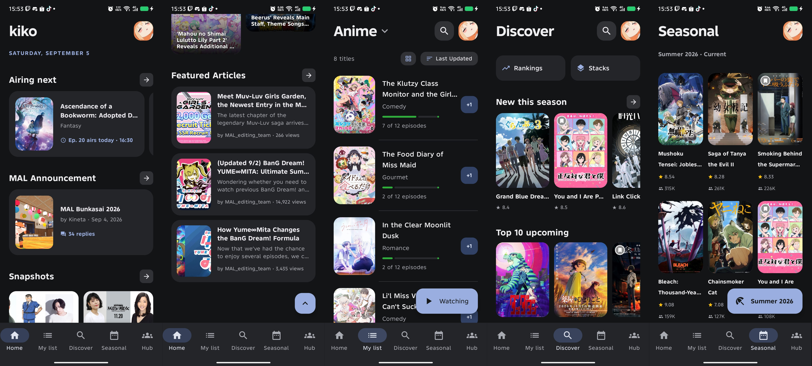
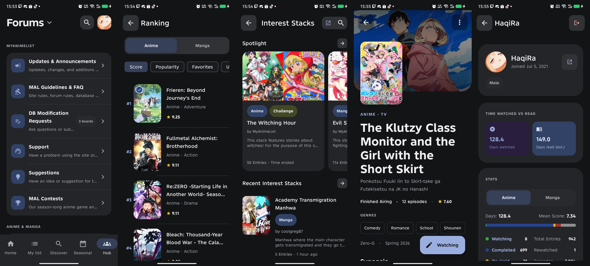

# Kiko for Android

> Yet Another Unofficial MyAnimeList Android Client to track anime and manga

Kiko is a Material 3 Android app built around **MyAnimeList (MAL)** — fast discovery, detailed title pages, list management, a combined forums/clubs hub, seasonal charts, and profile stats, all in one clean interface.

Join the community on Discord: [Himawari HS](https://discord.gg/KZYQHpDWKH)

---

## ✨ Features at a Glance

- **Home** — airing schedule (times synced via AniList), MAL latest announcement, forum snapshots, featured articles.
- **My List** — sync your MAL list, filter/sort/search, edit entries, quick +1 progress.
- **Discover** — search anime, manga, characters, people and companies, with advanced filters and personalized recommendations.
- **Rankings & Seasonal Charts** — browse by score, popularity, favorites or season/year (accessible from Home/Discover).
- **Title Details** — synopsis, characters, staff, reviews, recommendations, stats and related entries.
- **Hub** — MAL forums and clubs in one tab, including Interest Stacks browsing.
- **Profile & Stats** — OAuth login, activity breakdowns by genre, score, format, and year.
- **Appearance** — theming, dynamic/custom colors, AMOLED dark, Romaji/English titles, built-in update checker.
- **Deep Links** — open MAL anime/manga links directly in Kiko.

---

## 🖼️ Screenshots




---

## 📦 Installation

Download the latest APK from the **GitHub Releases** page. Kiko targets **Android 8.0 (API 26)+**. Since it's distributed outside Google Play, Android may prompt you to allow installs from the source you used.

---

## 🛠️ Building from Source

**Requirements:** Android Studio, JDK 17, Android SDK Platform 35, a MyAnimeList API client ID.

```bash
git clone https://github.com/SyHaqi/kiko.git
cd kiko
```

Copy `local.properties.example` → `local.properties` and set:

```properties
MAL_CLIENT_ID=YOUR_MYANIMELIST_CLIENT_ID
```

Kiko uses OAuth with redirect URI `com.kiko.tracker://oauth/callback`. **Do not include a MAL client secret** — only the client ID is needed.

Build:

```bash
./gradlew assembleDebug   # macOS/Linux
gradlew.bat assembleDebug # Windows
```

APK output: `app/build/outputs/apk/debug/`. Release versions are derived from the latest Git tag (e.g. `v2.7.1` → `2.7.1`).

---

## 🧱 Built With

Kotlin · Jetpack Compose · Material 3 · AndroidX · MyAnimeList API · Tenrai API · AniList API · OkHttp · Coil · Jsoup · Kotlin Coroutines

---

## 🌐 Data Sources

Kiko pulls data from **MyAnimeList** (accounts, lists, titles, forums, clubs, stacks), the **Tenrai API** (discovery/search), **AniList** (airing schedule accuracy), and **GitHub Releases** (update checks). Kiko doesn't operate or own these services.

---

## ⚠️ Disclaimer

Kiko is an **unofficial third-party MyAnimeList client**, not affiliated with, sponsored by, or endorsed by MyAnimeList. All MAL trademarks, artwork, and user content belong to their respective owners. Availability may change if MAL or other services update their APIs.

---

## 📄 License

Licensed under **GPL-3.0** — see [`LICENSE`](LICENSE) for full terms. You're free to use, study, modify, and redistribute Kiko's source under the same license. Third-party dependencies and assets may carry their own licenses.

Copyright © 2026 Kiko contributors.

---

## 💬 Community

Questions, feedback, or bug reports? Join the [Kiko Discord](https://discord.gg/KZYQHpDWKH).